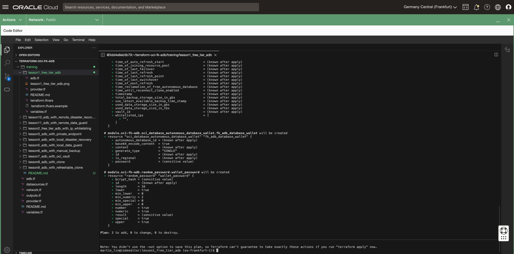

# FoggyKitchen Autonomous Database Serverless with Terraform 

## Course description

This is an in-depth course designed to equip participants with the skills to efficiently deploy and manage Oracle's Autonomous Database Serverless instances using Terraform, a popular infrastructure as code (IaC) tool. This course covers the foundational principles of Autonomous Database Serverless, emphasizing hands-on practice with Terraform to automate the provisioning, scaling, and management of databases in the cloud. Participants will learn to navigate the Oracle Cloud Infrastructure, implement security best practices, manage backups, and understand disaster recovery options. By the end of this course, attendees will have the knowledge to leverage Terraform for streamlined database administration, ensuring high availability and performance for critical applications.

[Lesson 1: Creating Free Tier Autonomous DB Serverless](lesson1_free_tier_adb)

This lesson guides you through the process of creating an Autonomous Database (ADB) Serverless on Oracle's Free Tier, offering a practical start for users seeking cost-effective solutions without compromising on capabilities.  

[Lesson 2: Creating Free Tier Autonomous DB Serverless with IP Whitelisting](lesson2_free_tier_adb_with_ip_whitelisting)

In this lesson, we'll set up a Free Tier Autonomous Database and implement IP whitelisting, including our public IP address. This approach will restrict access to the publicly available database exclusively to our laptop.

[Lesson 3: Creating Autonomous DB Serverless with Private Endpoint](lesson3_adb_with_private_endpoint)

In this lesson, we explore the intricacies of setting up an Oracle Autonomous Database (ADB) with a private endpoint, focusing on enhancing security and network isolation. This lesson provides step-by-step instructions on configuring your ADB instance in Oracle Cloud Infrastructure (OCI) to use private endpoints, ensuring secure, internal access to your database without exposure to the public internet. 

[Lesson 4: Creating Autonomous DB Serverless with Local Disaster Recovery](lesson4_adb_with_local_disaster_recovery)

In this lesson, we'll delve into the creation of an Oracle Autonomous Database (ADB) with a focus on incorporating local disaster recovery, ensuring your data remains secure and accessible, even during local infrastructure failures.  

[Lesson 5: Creating Autonomous DB Serverless with Local Data Guard](lesson5_adb_with_local_data_guard)

In this lesson, we'll delve into the creation of an Oracle Autonomous Database (ADB) with a focus on incorporating local Data Guard, ensuring your data remains secure and accessible, even during local infrastructure failures. 

[Lesson 6: Creating Autonomous DB Serverless with Manual Backup](lesson6_adb_with_manual_backup)

In this lesson, we'll focus on configuring an Autonomous Database with manual backup capabilities, which will enable you to create backups on demand. These manual backups will serve as the foundation for creating clone Autonomous DB Instances, providing you with greater flexibility and control over your database environment.

[Lesson 7: Creating Autonomous DB Serverless integrated with OCI Vault](lesson7_adb_with_oci_vault)

This lesson delves into the intricacies of setting up an Autonomous Database Shared instance, emphasizing the integration with OCI Vault for top-tier security alignment with organizational policies. It meticulously covers how to configure OCI Vault to serve as a repository for customer-managed encryption keys, a critical step for organizations that mandate direct control over their encryption mechanisms. The lesson clarifies the process whereby the Autonomous Database employs the customer-managed master encryption key stored in OCI Vault to generate the Transparent Data Encryption (TDE) master key, ensuring data is encrypted under the organization's governance.

[Lesson 8: Creating Autonomous DB Serverless with Full Clone](lesson8_adb_with_clone)

This lesson focuses on the process of creating an Autonomous Database Shared instance by leveraging the cloning feature, an essential technique for database management and scalability. It outlines the steps to efficiently clone an existing database, allowing for the quick deployment of test environments or the replication of data for analytical purposes. Through hands-on exercises, participants will learn to utilize the cloning capabilities to enhance their database infrastructure, ensuring seamless data management and operational continuity in Oracle Cloud Infrastructure.

[Lesson 9: Creating Autonomous DB Serverless with Refreshable Clone](lesson9_adb_with_refreshable_clone)

This lesson introduces the advanced concept of creating a refreshable clone in an Autonomous Database Shared environment, emphasizing the critical role of such clones in maintaining data currency and supporting development efforts with minimal downtime. This module guides learners through the process of setting up a refreshable clone, which allows for the periodic synchronization of data from the source database, ensuring that the clone remains up-to-date with the latest changes. 

[Lesson 10: Creating Autonomous DB Serverless with Remote Standby (Disaster Recovery)](lesson10_adb_with_remote_disaster_recovery)

This lesson explores the essential techniques for setting up an Autonomous Database (ADB) with shared resources, focusing on the implementation of a remote standby database for disaster recovery without utilizing DataGuard technology. 

[Lesson 11: Creating Autonomous DB Serverless with Remote Standby (DataGuard-based)](lesson11_adb_with_remote_data_guard)

This lesson explores the essential techniques for setting up an Autonomous Database (ADB) with shared resources, focusing on the implementation of a remote standby database for disaster recovery utilizing DataGuard technology.  