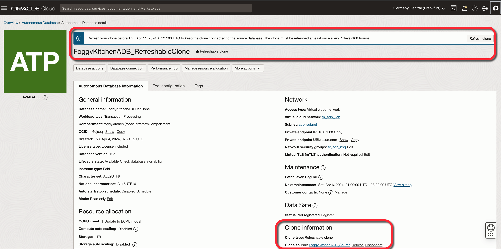

# FoggyKitchen OCI Autonomous Database with Terraform 

## LESSON 9 - Creating Autonomous DB Serverless with Refreshable Clone

This lesson introduces the advanced concept of creating a refreshable clone in an Autonomous Database Shared environment, emphasizing the critical role of such clones in maintaining data currency and supporting development efforts with minimal downtime. This module guides learners through the process of setting up a refreshable clone, which allows for the periodic synchronization of data from the source database, ensuring that the clone remains up-to-date with the latest changes. 



## Deploy Using Oracle Resource Manager

1. Click [](https://cloud.oracle.com/resourcemanager/stacks/create?region=home&zipUrl=https://github.com/mlinxfeld/terraform-oci-fk-adb/releases/latest/download/terraform-oci-fk-adb-lesson9.zip)

    If you aren't already signed in, when prompted, enter the tenancy and user credentials.

2. Review and accept the terms and conditions.

3. Select the region where you want to deploy the stack.

4. Follow the on-screen prompts and instructions to create the stack.

5. After creating the stack, click **Terraform Actions**, and select **Plan**.

6. Wait for the job to be completed, and review the plan.

    To make any changes, return to the Stack Details page, click **Edit Stack**, and make the required changes. Then, run the **Plan** action again.

7. If no further changes are necessary, return to the Stack Details page, click **Terraform Actions**, and select **Apply**. 

## Deploy Using the Terraform CLI in Cloud Shell

### Clone of the repo into OCI Cloud Shell

Now, you'll want a local copy of this repo. You can make that with the commands:
Clone the repo from github by executing the command as follows and then go to proper subdirectory:

```
martin_lin@codeeditor:~ (eu-frankfurt-1)$ git clone https://github.com/mlinxfeld/terraform-oci-fk-adb.git

martin_lin@codeeditor:~ (eu-frankfurt-1)$ cd terraform-oci-fk-adb

martin_lin@codeeditor:terraform-oci-fk-adb (eu-frankfurt-1)$ cd training/lesson9_adb_with_refreshable_clone/
```

### Prerequisites
Create environment file with terraform.tfvars file starting with example file:

```
martin_lin@codeeditor:lesson9_adb_with_refreshable_clone (eu-frankfurt-1)$ cp terraform.tfvars.example terraform.tfvars

martin_lin@codeeditor:lesson9_adb_with_refreshable_clone (eu-frankfurt-1)$ vi terraform.tfvars

tenancy_ocid       = "ocid1.tenancy.oc1..<your_tenancy_ocid>"
compartment_ocid   = "ocid1.compartment.oc1..<your_comparment_ocid>"
region             = "<oci_region>"
adb_password       = "<adb_password>"
```

### Initialize Terraform

Run the following command to initialize Terraform environment:

```
martin_lin@codeeditor:lesson9_adb_with_refreshable_clone (eu-frankfurt-1)$ terraform init

Initializing the backend...
Initializing modules...
Downloading git::https://github.com/mlinxfeld/terraform-oci-fk-adb.git for fk-adb...
- fk-adb in .terraform/modules/fk-adb

Initializing provider plugins...
- Reusing previous version of oracle/oci from the dependency lock file
- Reusing previous version of hashicorp/tls from the dependency lock file
- Installing oracle/oci v5.29.0...
- Installed oracle/oci v5.29.0 (signed by a HashiCorp partner, key ID 1533A49284137CEB)
- Installing hashicorp/tls v4.0.5...
- Installed hashicorp/tls v4.0.5 (signed by HashiCorp)

Partner and community providers are signed by their developers.
If you'd like to know more about provider signing, you can read about it here:
https://www.terraform.io/docs/cli/plugins/signing.html

Terraform has been successfully initialized!

You may now begin working with Terraform. Try running "terraform plan" to see
any changes that are required for your infrastructure. All Terraform commands
should now work.

If you ever set or change modules or backend configuration for Terraform,
rerun this command to reinitialize your working directory. If you forget, other
commands will detect it and remind you to do so if necessary.
```

### Apply the changes 

Run the following command for applying changes with the proposed plan:

```
martin_lin@codeeditor:lesson9_adb_with_refreshable_clone (eu-frankfurt-1)$ terraform apply
module.oci-fk-adb.data.oci_core_services.AllOCIServices[0]: Reading...
module.oci-fk-adb.data.oci_core_services.AllOCIServices[0]: Read complete after 0s [id=CoreServicesDataSource-0]

Terraform used the selected providers to generate the following execution plan. Resource actions are indicated with the following symbols:
  + create

Terraform will perform the following actions:

  # module.oci-fk-adb.oci_core_nat_gateway.fk_adb_natgw[0] will be created
  + resource "oci_core_nat_gateway" "fk_adb_natgw" {
      + block_traffic  = (known after apply)
      + compartment_id = "ocid1.compartment.oc1..aaaaaaaaiyy4srmrb32v5rlniicwmpxsytywiucgbcp5ext6e4ahjfuloewa"
      + defined_tags   = (known after apply)
      + display_name   = "fk_adb_natgw"
      + freeform_tags  = (known after apply)
      + id             = (known after apply)
      + nat_ip         = (known after apply)
      + public_ip_id   = (known after apply)
      + route_table_id = (known after apply)
      + state          = (known after apply)
      + time_created   = (known after apply)
      + vcn_id         = (known after apply)
    }

(...)

Plan: 22 to add, 0 to change, 0 to destroy.

Do you want to perform these actions?
  Terraform will perform the actions described above.
  Only 'yes' will be accepted to approve.

  Enter a value: yes

(...)
module.oci-fk-adb-clone.oci_database_autonomous_database.fk_adb_database: Still creating... [5m40s elapsed]
module.oci-fk-adb-clone.oci_database_autonomous_database.fk_adb_database: Still creating... [5m50s elapsed]
module.oci-fk-adb-clone.oci_database_autonomous_database.fk_adb_database: Still creating... [6m0s elapsed]
module.oci-fk-adb-clone.oci_database_autonomous_database.fk_adb_database: Still creating... [6m10s elapsed]
module.oci-fk-adb-clone.oci_database_autonomous_database.fk_adb_database: Still creating... [6m20s elapsed]
module.oci-fk-adb-clone.oci_database_autonomous_database.fk_adb_database: Still creating... [6m30s elapsed]
module.oci-fk-adb-clone.oci_database_autonomous_database.fk_adb_database: Still creating... [6m40s elapsed]
module.oci-fk-adb-clone.oci_database_autonomous_database.fk_adb_database: Still creating... [6m50s elapsed]
module.oci-fk-adb-clone.oci_database_autonomous_database.fk_adb_database: Still creating... [7m0s elapsed]
module.oci-fk-adb-clone.oci_database_autonomous_database.fk_adb_database: Still creating... [7m10s elapsed]
module.oci-fk-adb-clone.oci_database_autonomous_database.fk_adb_database: Still creating... [7m20s elapsed]
module.oci-fk-adb-clone.oci_database_autonomous_database.fk_adb_database: Still creating... [7m30s elapsed]
module.oci-fk-adb-clone.oci_database_autonomous_database.fk_adb_database: Still creating... [7m40s elapsed]
module.oci-fk-adb-clone.oci_database_autonomous_database.fk_adb_database: Still creating... [7m50s elapsed]
module.oci-fk-adb-clone.oci_database_autonomous_database.fk_adb_database: Still creating... [8m0s elapsed]
module.oci-fk-adb-clone.oci_database_autonomous_database.fk_adb_database: Still creating... [8m10s elapsed]
module.oci-fk-adb-clone.oci_database_autonomous_database.fk_adb_database: Still creating... [8m20s elapsed]
module.oci-fk-adb-clone.oci_database_autonomous_database.fk_adb_database: Still creating... [8m30s elapsed]
module.oci-fk-adb-clone.oci_database_autonomous_database.fk_adb_database: Still creating... [8m40s elapsed]
module.oci-fk-adb-clone.oci_database_autonomous_database.fk_adb_database: Still creating... [8m50s elapsed]
module.oci-fk-adb-clone.oci_database_autonomous_database.fk_adb_database: Creation complete after 8m52s [id=ocid1.autonomousdatabase.oc1.eu-frankfurt-1.antheljtdngk4giamyoozpwdyrlegqat36k2huplh2szdrhyke5bsgreempq]
module.oci-fk-adb-clone.oci_database_autonomous_database_wallet.fk_adb_database_wallet: Creating...
module.oci-fk-adb-clone.oci_database_autonomous_database_wallet.fk_adb_database_wallet: Creation complete after 2s [id=DatabaseAutonomousDatabaseWalletResource-4153897857]

Apply complete! Resources: 22 added, 0 changed, 0 destroyed.

```

### Destroy the changes 

Run the following command for destroying all resources:

```
martin_lin@codeeditor:lesson9_adb_with_refreshable_clone (eu-frankfurt-1)$ terraform destroy 
module.oci-fk-adb.random_password.wallet_password: Refreshing state... [id=none]
module.oci-fk-adb.data.oci_core_services.AllOCIServices[0]: Reading...
module.oci-fk-adb.oci_core_vcn.fk_adb_vcn[0]: Refreshing state... [id=ocid1.vcn.oc1.eu-frankfurt-1.amaaaaaadngk4giaak76a4mrugw77uydl3caqh4xbwetopo6snh4vmmnjifq]
module.oci-fk-adb.data.oci_core_services.AllOCIServices[0]: Read complete after 0s [id=CoreServicesDataSource-0]
module.oci-fk-adb.oci_core_network_security_group.fk_adb_nsg[0]: Refreshing state... [id=ocid1.networksecuritygroup.oc1.eu-frankfurt-1.aaaaaaaak6aax7qtie2axbxy3byrjj657rlocwzzxwk7yo5zfymm7awqunra]
module.oci-fk-adb.oci_core_service_gateway.fk_adb_sg[0]: Refreshing state... [id=ocid1.servicegateway.oc1.eu-frankfurt-1.aaaaaaaa5ineold47kswhdfmosexpheifiqixqsm5emnujypaqrozunow2yq]
module.oci-fk-adb.oci_core_nat_gateway.fk_adb_natgw[0]: Refreshing state... [id=ocid1.natgateway.oc1.eu-frankfurt-1.aaaaaaaasqkk4o4zqoxbniatchcawkthx66twlzaj2at26u3gsta3zgmwkra]
module.oci-fk-adb.oci_core_network_security_group_security_rule.fk_adb_nsg_egress_group_sec_rule[0]: Refreshing state... [id=F58926]
module.oci-fk-adb.oci_core_network_security_group_security_rule.fk_adb_nsg_ingress_group_sec_rule[0]: Refreshing state... [id=8D6847]
module.oci-fk-adb.oci_core_route_table.fk_adb_rt_via_natgw_and_sg[0]: Refreshing state... [id=ocid1.routetable.oc1.eu-frankfurt-1.aaaaaaaaq56qlixpwxwxdj4tl5ycwk7kyc2pr6rd47dj7xro5lqwqg5zfozq]
module.oci-fk-adb.oci_core_subnet.fk_adb_subnet[0]: Refreshing state... [id=ocid1.subnet.oc1.eu-frankfurt-1.aaaaaaaag65izip52vdyyirngear2ldv3vjut6euiebi2adckm7driqfa3oa]
module.oci-fk-adb.oci_database_autonomous_database.fk_adb_database: Refreshing state... [id=ocid1.autonomousdatabase.oc1.eu-frankfurt-1.antheljtdngk4giatol3tuonq74wvp4xnth2itmuymkulx3a6ms65kyjaqia]
module.oci-fk-adb.oci_database_autonomous_database_wallet.fk_adb_database_wallet: Refreshing state... [id=DatabaseAutonomousDatabaseWalletResource-1831233018]

Terraform used the selected providers to generate the following execution plan. Resource actions are indicated with the following symbols:
  - destroy

Terraform will perform the following actions:

  # module.oci-fk-adb.oci_core_nat_gateway.fk_adb_natgw[0] will be destroyed
  - resource "oci_core_nat_gateway" "fk_adb_natgw" {
      - block_traffic  = false -> null
      - compartment_id = "ocid1.compartment.oc1..aaaaaaaaiyy4srmrb32v5rlniicwmpxsytywiucgbcp5ext6e4ahjfuloewa" -> null
      - defined_tags   = {} -> null
      - display_name   = "fk_adb_natgw" -> null
      - freeform_tags  = {} -> null
      - id             = "ocid1.natgateway.oc1.eu-frankfurt-1.aaaaaaaasqkk4o4zqoxbniatchcawkthx66twlzaj2at26u3gsta3zgmwkra" -> null
      - nat_ip         = "141.147.45.193" -> null
      - public_ip_id   = "ocid1.publicip.oc1.eu-frankfurt-1.aaaaaaaaeptr7efqvm6n2fcurqceiau7ldpouvyhcju42h7ltpgffkaueyla" -> null
      - state          = "AVAILABLE" -> null
      - time_created   = "2024-04-02 13:51:00.075 +0000 UTC" -> null
      - vcn_id         = "ocid1.vcn.oc1.eu-frankfurt-1.amaaaaaadngk4giaak76a4mrugw77uydl3caqh4xbwetopo6snh4vmmnjifq" -> null
    }

(...)

Plan: 0 to add, 0 to change, 22 to destroy.

Do you really want to destroy all resources?
  Terraform will destroy all your managed infrastructure, as shown above.
  There is no undo. Only 'yes' will be accepted to confirm.

  Enter a value: yes

module.oci-fk-adb.oci_core_network_security_group_security_rule.fk_adb_nsg_egress_group_sec_rule[0]: Destroying... [id=F58926]
module.oci-fk-adb.oci_core_network_security_group_security_rule.fk_adb_nsg_ingress_group_sec_rule[0]: Destroying... [id=8D6847]
module.oci-fk-adb.oci_database_autonomous_database_wallet.fk_adb_database_wallet: Destroying... [id=DatabaseAutonomousDatabaseWalletResource-1831233018]
module.oci-fk-adb.oci_database_autonomous_database_wallet.fk_adb_database_wallet: Destruction complete after 0s

(...)

module.oci-fk-adb.oci_core_network_security_group.fk_adb_nsg[0]: Destroying... [id=ocid1.networksecuritygroup.oc1.eu-frankfurt-1.aaaaaaaak6aax7qtie2axbxy3byrjj657rlocwzzxwk7yo5zfymm7awqunra]
module.oci-fk-adb.oci_core_network_security_group.fk_adb_nsg[0]: Destruction complete after 0s
module.oci-fk-adb.oci_core_vcn.fk_adb_vcn[0]: Destroying... [id=ocid1.vcn.oc1.eu-frankfurt-1.amaaaaaadngk4giaak76a4mrugw77uydl3caqh4xbwetopo6snh4vmmnjifq]
module.oci-fk-adb.oci_core_vcn.fk_adb_vcn[0]: Destruction complete after 1s

Destroy complete! Resources: 22 destroyed.
```
